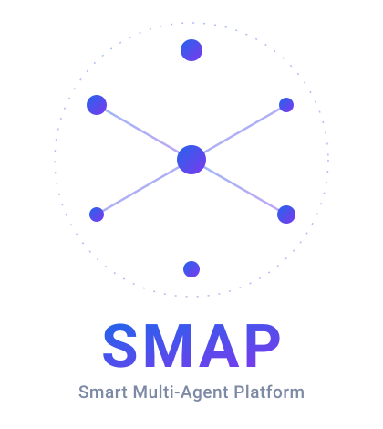

# SMAP — Smart Multi-Agent Platform

SMAP is a self-hosted web application for composing and conversing with groups of LLM-powered agents. Users supply their own API keys from third-party model providers (Anthropic Claude, OpenAI, Google Gemini). SMAP does not charge usage fees; model costs are billed directly by the providers to the key owner.

Deployment target: single-host Docker Compose (16-core / 32 GB). There is no cloud-managed option or SaaS tier.

<p align="center">
  
</p>


---

## What SMAP does

**Key and credential management.** Users upload provider API keys stored with envelope encryption (Vault Transit backend). Keys are organized into ordered Key Groups with automatic rotation, per-key sliding-window quota tracking, and failover. A background worker emits notifications when 80% of a key's quota is consumed.

**Agent configuration.** An Agent is a named LLM persona with a system prompt, a Key Group, an optional RAG configuration, an optional Knowledge Map binding, an optional set of Skills, and an optional set of MCP tool servers. Agents can exchange messages via the Agent-to-Agent (A2A) protocol and be composed into multi-agent workflows.

**Agent Groups.** Agents within a project can be organized into named Agent Groups with their own membership. A group can own a shared Concept Map (see below) that pools retrieval across every member agent.

**Prompt Studio.** Reusable prompt templates and prompt-assistant configurations (personal or organization-scoped) help users draft and iterate on agent system prompts, with assistant responses streamed to the UI over WebSocket.

**Skills.** Reusable Skill bundles can be authored and scoped to an agent, a project, an organization, or the whole platform, then bound to individual agents to extend their capabilities.

**Retrieval-augmented generation.** Each agent can be bound to a per-agent RAG configuration for dense vector search over uploaded files (Qdrant) and, independently, to a Knowledge Map — a designer-authored knowledge graph built from uploaded documents (Neo4j + Qdrant) with a per-agent document allowlist. Both are populated by background ingestion workers with two-phase-commit consistency across the vector and graph stores, and retrieved chunks or graph entities are surfaced as citations on the agent's reply.

**Concept Map.** A Chat Room, Agent Group, or Workspace can each own a Concept Map — a temporal knowledge graph (Neo4j + Qdrant) built incrementally from conversation history and shared by every agent present in that scope, with results weighted by recency. Unlike a Knowledge Map, a Concept Map has no document source and no single owning agent. Build progress for both graph types streams to the UI over WebSocket.

**MCP tool servers.** Agents can call built-in tool servers — file access, web search (via Tavily, Brave, Serper, or Google CSE), and a Code Interpreter whose session-scoped kernel persists state across calls and renders inline chart artifacts — as well as user-provided external MCP servers. External servers run inside a gVisor-isolated Docker-in-Docker sandbox with an egress proxy.

**Chat rooms and workspaces.** Projects contain Workspaces; Workspaces contain Chat Rooms. Chat Rooms support real-time messaging over WebSocket, file attachments (resumable upload via TUS), full-text search (PostgreSQL GIN index), summoning specific agents by `@mention`, optional per-user display names, and transcript export to Markdown, JSON, or PDF (optionally date-ranged) stored in MinIO. Permanent guest links allow external users to join a room without a platform account.

**Activities.** Chat Rooms can host scored, interactive Activities — self-contained plugins with their own validators, surfaced inline in the conversation.

**Workflow engine.** Workflows are directed graphs of agent steps supporting 11 executor types, 7 trigger kinds, and the SMAP Expression Language (SEL v1) for dynamic routing. Execution is tracked in a `workflow_runs` finite-state machine (running / waiting / succeeded / failed / cancelled) with a 90-day archive policy. A dry-run mode validates a definition and exercises its routing without invoking side-effecting steps.

**Multi-tenant access control.** Accounts belong to Organizations; Organizations contain Projects. Each scope has a role hierarchy (Original Creator, Org Owner, Org Member, Project Owner, Project Member, Guest). Authorization is enforced through a 26-capability permission matrix evaluated per request.

**Admin and observability.** Admins can manage users (ban, unban, soft-delete, hard-delete), promote or demote admins with a last-admin guard, manage IP ban lists (CIDR), adjust per-bucket rate-limit policies, force-transfer Original Creator status, impersonate users in read-only mode, and query or export the append-only audit log. Prometheus metrics, OpenTelemetry tracing, and structured JSON logging are included.

**Localization.** The web interface is fully internationalized (vue-i18n) and ships English and Traditional Chinese, switchable from the top bar.

**Retention.** A background worker runs 23 retention policies on a configurable schedule covering messages, file attachments, exports, audit logs, workflow run archives, key usage events, soft-deleted tenancy entities, expired tokens, sessions, and more.

---

## Architecture

```
Browser (Vue 3 SPA)
    |
    | HTTPS / WebSocket
    v
Nginx  (TLS termination, gzip, static assets, WS proxy)
    |
    v
FastAPI  (stateless API gateway)
    |  AuthN/AuthZ middleware, rate limiter, request-ID injection
    |
    +---> ARQ worker pool  (background jobs: retention, RAG ingestion, export, threshold)
    |
    +---> PostgreSQL   (primary relational store, FTS GIN, append-only audit)
    +---> Redis        (session denylist, rate-limit counters, A2A streams, pub/sub)
    +---> Qdrant       (dense vector index for RAG)
    +---> Neo4j        (knowledge graph for Concept Map + Knowledge Map)
    +---> MinIO        (object storage: chat-uploads, rag-sources, exports)
    +---> Vault        (Transit encryption, JWT signing keys, KV secrets)
    +---> MCP sandbox  (Docker-in-Docker + gVisor + egress proxy)
```

Eight WebSocket endpoints provide real-time push: per-user notifications, per-chatroom messages, workflow run streaming, file-RAG ingestion progress, Concept Map build progress, Knowledge Map build progress, Prompt Studio assistant token streaming, and admin log tailing. All WebSocket connections authenticate via the `bearer.<token>` subprotocol.

---

## Technology stack

| Layer | Technology |
|---|---|
| API server | Python 3.12, FastAPI 0.137, Uvicorn 0.32 |
| Database ORM | SQLAlchemy 2.0 (async core), asyncpg 0.30 |
| Migrations | Alembic 1.13 |
| Cache / queue | Redis 5.2, ARQ 0.26 |
| Vector store | Qdrant 1.12 |
| Graph store | Neo4j 5.24 |
| Object storage | MinIO 7.2 (S3-compatible) |
| Secrets | HashiCorp Vault 2.3 (HVAC) |
| Auth | Argon2-cffi (passwords), Vault Transit RS256 (JWT signing in `shared_kernel/auth/jwt.py`) |
| HTTP client | HTTPX 0.27 (async) |
| Serialization | ORJSON 3.11, Pydantic 2.9 |
| Logging | Loguru 0.7 (structured JSON) |
| Metrics | Prometheus-client 0.21 |
| Tracing | OpenTelemetry SDK 1.44 |
| Frontend | Vue 3.5, TypeScript 5.6, Vite 6.4 |
| State | Pinia 2.2, TanStack Vue Query 5.101 |
| UI | Custom design-system component library (40+ components), Tailwind CSS 4.3, Heroicons 2.2 |
| Forms | vee-validate 4.14, Zod 3.23 |
| Workflow editor | Vue Flow 1.48 |
| Content rendering | markdown-it 14, KaTeX, Mermaid, highlight.js (DOMPurify-sanitized) |
| Localization | vue-i18n 11.4 (English, Traditional Chinese) |
| Linting | Ruff 0.7, MyPy 1.13, ESLint 9.28 |
| Testing | Pytest 8.3, pytest-asyncio 0.24, Vitest 4.1, Playwright 1.61 |

---

## Repository layout

```
backend/
  app/
    api/v1/          REST route handlers (one file per resource)
    api/ws/          WebSocket endpoints
    api/middleware/  Request-ID, trusted-proxy, IP-ban, auth, rate-limit, security-headers
    config/          Pydantic settings (all SMAP_ prefixed env vars)
    workers/         ARQ task definitions
  contexts/          Fourteen DDD bounded contexts
    identity/        Users, sessions, email verification, password reset, admins, IP bans
    tenancy/         Organizations, projects, membership, invites, Original Creator transfer
    keys/            API keys, key groups, key usage events
    agents/          Agent configs, MCP tool bindings, wake-up triggers
    agent_groups/    Agent groups within a project, membership, group-owned Concept Map
    knowledge/       RAG configs, Knowledge Map (file-graph) configs, Concept Map (conversation-graph) configs
    conversation/    Workspaces, chat rooms, messages, attachments, guests, exports
    activities/      Chatroom-hosted scored interactive activities
    workflow/        Workflows, workflow runs, SEL v1 execution
    orchestration/   A2A streams, wakeup configs, instruct chains, approvals, sub-agent inheritance
    prompt_studio/   Prompt-assistant configs, reusable prompt templates
    skills/          Reusable Skill bundles (agent, project, org, platform scope)
    audit/           Append-only audit log
    notification/    In-app user notifications
  shared_kernel/
    auth/            JWT, RBAC matrix, rate limiter, IP ban cache, FastAPI deps
    db/              SQLAlchemy engine, session factory, table registry
    errors/          Error handling (RFC 7807 Problem Details, custom error base)
    i18n/            Internationalization helpers
    infra/           Shared external service clients (Vault, Redis buckets)
    logging/         Structured logging via loguru with JSON + redaction
    markdown/        Markdown rendering and sanitization helpers
    observability/   Prometheus metrics and OpenTelemetry instrumentation
    realtime/        WebSocket connection management and pub/sub helpers
    security/        Envelope encryption (DEK + Vault Transit)
    storage/         MinIO client wrapper
  alembic/           Database migrations (versions 0000 through 0073)
  alembic.ini

frontend/
  src/
    app/             Root component, router, entry point
    shared/          API client (generated from OpenAPI), composables, transport, i18n, UI, errors
    slices/          Twelve feature slices: identity, tenancy, keys, agents, agent-groups, conversation, activities, workflow, prompt-studio, skills, notifications, admin
  tests/             Vitest setup, MSW mocks, render helpers, factories
  e2e/               Playwright E2E specs (15 golden paths)
  scripts/           CI gate scripts (global CSS, view tests, type coverage, bundle size, OpenAPI drift, typecheck gate)
  Dockerfile         Multi-stage production build (node → nginx)

deploy/
  compose/           Docker Compose files (base, staging overlay, prod overlay, test overlay, dev override)
  compose/nginx/     Nginx config (TLS, HSTS, CSP, WS upgrade, banner suppression)
  vault/             Vault policies (HCL) and bootstrap SOP
  observability/     Optional OTel + Prometheus + Alertmanager + Loki + Grafana stack (with Postgres/Redis/Vault exporters)
  sandbox/           gVisor MCP + code-interpreter sandbox images and driver
  reranker/          Standalone BGE reranker service (RAG re-ranking)
  scripts/           Backup, restore, preflight, and TLS-expiry operator scripts
  README.md          Operator walk-through (< 60 min bring-up)

docs/
  implement/         Per-phase construction plans (A through M, plus supplemental remediation docs)
  audits/            /audit dossiers — functional bug-hunt findings, one folder per sweep
  tasks/             /spec dossiers (spec.md per change) plus BOARD.md sequencing index
  operations.md      Operator manual
  release-checklist.md  Pre-release verification checklist
  frontend-exceptions.md  CI gate exception registry
  workflow.schema.json + workflow.schema.md   Normative workflow schema and SEL v1

REQUIREMENTS.md      Software Requirements Specification (authoritative)
```

Each bounded context follows a four-layer structure enforced by import-linter: `domain` (pure Python, no framework imports), `infrastructure` (SQLAlchemy tables and external adapters), `application` (service classes), and `interfaces` (public facade and error mapping). Routers may only import from `interfaces`.

---

## Authoritative documents

| Document | Purpose |
|---|---|
| `REQUIREMENTS.md` | Software Requirements Specification. Every requirement is tagged with an ID of the form `[Rxx.yy]`. If the implementation disagrees with this document, the SRS wins. |
| `docs/implement/00-overview.md` | Construction plan: ten original phases (A–J) plus remediation phases K–M, with dependency graph and phase-gate status. |
| `docs/workflow.schema.json` + `docs/workflow.schema.md` | Normative workflow JSON Schema and SMAP Expression Language (SEL v1) specification. |
| `docs/operations.md` | Operator manual: structured logging fields, health check behavior, resource limits, Alembic migration policy, bootstrap CLI, RFC 7807 error catalog, runbooks. |
| `deploy/vault/README.md` | Vault bootstrap procedure, key rotation SOP, disaster recovery scenarios. |
| `deploy/README.md` | Operator deployment walk-through. |
| `docs/release-checklist.md` | Pre-release verification checklist (Vault, backend, frontend, E2E, data, docs). |
| `docs/frontend-exceptions.md` | CI gate exception registry with rationale. |

All other documents in this repository are derived from these files. Do not treat them as independent sources of truth.

---

## Quickstart (developer)

Prerequisites: Docker, Docker Compose v2, Python 3.12, Node.js 20+, pnpm.

```bash
cp .env.example .env          # edit for local overrides (keeps secrets out of git)
make install                  # install backend + frontend dependencies
make docker-up                # start Postgres, Redis, Qdrant, Neo4j, MinIO, Vault, Nginx, egress proxy, MCP sandbox supervisor
make bootstrap                # initialize Vault, run Alembic migrations, create MinIO buckets, set Neo4j constraints
make dev-backend              # start uvicorn with hot reload on :8000
make dev-frontend             # start Vite dev server on :5173
```

After the stack is running, `https://localhost:10443/healthz` (via Nginx to the backend) confirms liveness. `https://localhost:10443/readyz` confirms that all downstream dependencies (Postgres, Redis, Qdrant, Neo4j, MinIO, Vault) are reachable.

The OpenAPI documentation is available at `https://localhost:10443/api/docs` when `SMAP_APP_DOCS_ENABLED=true` (default in dev).

### Production deployment

See `deploy/README.md` for a full operator walk-through. Summary:

```bash
docker compose -f deploy/compose/docker-compose.yml \
  -f deploy/compose/docker-compose.prod.yml up -d
```

### E2E test stack

```bash
make docker-up-test           # build frontend + start full stack with seeded fixtures
cd frontend && pnpm run test:e2e
make docker-down-test         # tear down (removes volumes)
```

---

## Configuration

All settings are controlled through environment variables, most under the `SMAP_` prefix. The resolution order is: Vault KV (production), environment variable, `.env` file, hardcoded default.

Section prefixes:

| Prefix | Covers |
|---|---|
| `SMAP_APP_` | Application environment, version, docs toggle |
| `SMAP_DB_` | PostgreSQL DSN, pool size, statement timeout |
| `SMAP_REDIS_` | Redis DSN |
| `SMAP_QDRANT_` | Qdrant URL and API key |
| `SMAP_NEO4J_` | Neo4j URL, user, password, database |
| `SMAP_MINIO_` | MinIO endpoint, credentials, bucket names |
| `SMAP_VAULT_` | Vault address, AppRole credentials, Transit key names |
| `SMAP_JWT_` | Access and refresh token TTLs, issuer, audience |
| `SMAP_OBS_` | Prometheus metrics and OpenTelemetry tracing toggles |
| `SMAP_SEC_` | Trusted proxy CIDRs, CORS origins, CSP mode, file-scan toggle |
| `SMAP_LOG_` | Log level, service name, JSON toggle |
| `SMAP_EGRESS_` | Egress proxy controls for MCP sandbox traffic |
| `SMAP_WORKER_` | ARQ worker health-check port |
| `SMAP_LIMIT_` | Per-bucket rate-limit counts (R19.02) |
| `SANDBOX_*` (no `SMAP_` prefix) | gVisor MCP sandbox and code-interpreter image names |
| `SMTP_*` (no `SMAP_` prefix) | SMTP transport for email verification |

A handful of operational variables (`SANDBOX_*`, `SMTP_*`, `EGRESS_PROXY_SHARED_SECRET`, `RERANK_BGE_URL`, `GRAFANA_ADMIN_PASSWORD`) intentionally fall outside the `SMAP_` namespace. See `.env.example` for the full list with defaults.

---

## Conventions

**Endpoint paths.** All REST paths carry the `/api/` prefix and match `REQUIREMENTS.md` section 22 exactly. WebSocket paths are at `/ws/`.

**Error format.** All error responses follow RFC 7807 Problem Details. The `type` field uses the prefix `https://smap.local/problems/`. The error catalog is maintained in `docs/operations.md` section 6.

**Storage names.** MinIO buckets: `chat-uploads`, `rag-sources`, `exports`. Redis streams: `a2a:agent:{agent_id}`. Vault Transit keys: `smap-provider-secret`, `smap-guest-link`, `smap-jwt-sign`. Use these names verbatim; do not introduce aliases.

**Requirement traceability.** Commits, pull requests, and test docstrings cite at least one `[Rxx.yy]` requirement ID. When a new requirement must be added, it goes into `REQUIREMENTS.md` before any code is written.

**Specifications are English.** All files under `docs/`, `deploy/`, and the root SRS are English-only. Pull request descriptions may use zh-TW.

---

## License

Copyright (C) 2026 **Isaries**.

SMAP is dual-licensed:

- **Open-source license** — [GNU Affero General Public License v3.0 or later](./LICENSE) (AGPL-3.0-or-later). You may self-host, modify, and redistribute SMAP under the AGPL. Note that AGPL §13 requires you to make the complete corresponding source available to **all users who interact with the software over a network**, including any modifications you have made.
- **Commercial license** — for organizations that cannot accept the AGPL (for example, proprietary integrations or closed-source SaaS deployments), an alternative commercial license is available from the copyright holder. Open a **GitHub Discussion** under the **"Commercial / Licensing"** category to start the conversation.

Contributors must sign a Contributor License Agreement before pull requests can be merged. See [CONTRIBUTING.md](./CONTRIBUTING.md) and [CLA/](./CLA/) for details.

### Third-party services and their licenses

SMAP orchestrates several independent services through their network APIs. SMAP's source code is licensed as described above, but operators who **modify or redistribute** the bundled service binaries are bound by **those services' own licenses**:

| Component | License | Operator note |
|---|---|---|
| **MinIO** server | GNU AGPL-3.0 (since 2021-04) | Calling MinIO over the S3 API does not create a derivative work. Modifying the MinIO binary itself triggers AGPL §13 for MinIO. |
| **Neo4j Community Edition** | GNU GPL-3.0 | Bolt-protocol clients are not derivative works. Embedding or modifying the Neo4j binary triggers GPL §5. The Enterprise edition is a separate commercial product. |
| **HashiCorp Vault** | BUSL-1.1 (since v1.15) | Production use by competing managed-Vault providers is restricted. Operators not in that situation are unaffected; alternatively, the [OpenBao](https://openbao.org) fork is MPL-2.0. |
| **PostgreSQL** | PostgreSQL License (BSD-style) | No restrictions for self-hosted deployment. |
| **Redis** (≤ 7.2) | BSD-3-Clause | Redis 7.4+ uses RSALv2/SSPLv1; pin to 7.2 for unrestricted use, or use the [Valkey](https://valkey.io) fork. |
| **Qdrant** | Apache-2.0 | No restrictions. |
| **Nginx** | BSD-2-Clause | No restrictions. |

Application-level dependencies (Vue, FastAPI, SQLAlchemy, etc.) are predominantly MIT or Apache-2.0; see `pyproject.toml` and `package.json` for the authoritative list.
