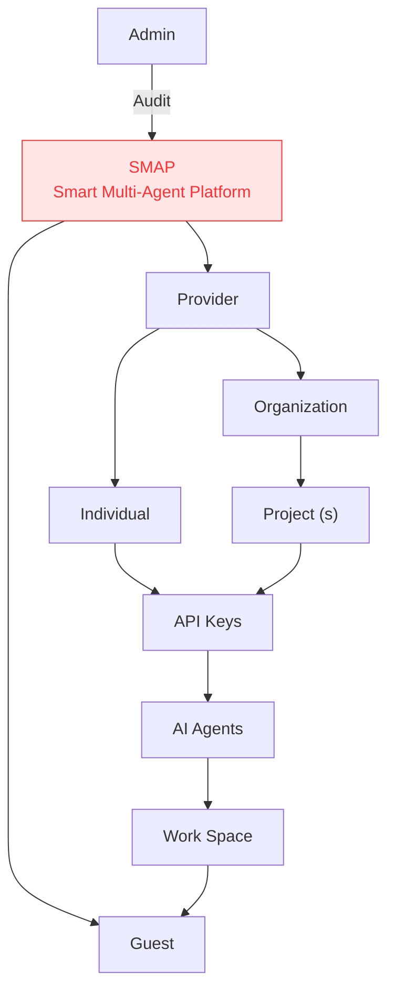
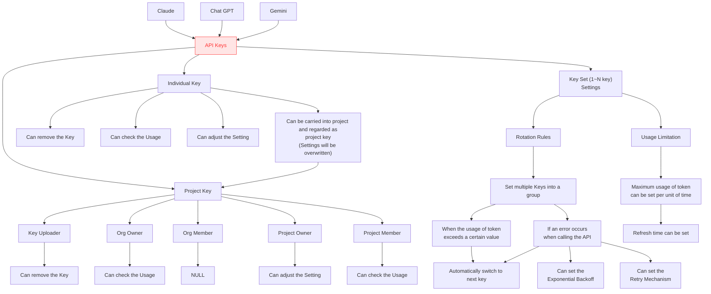
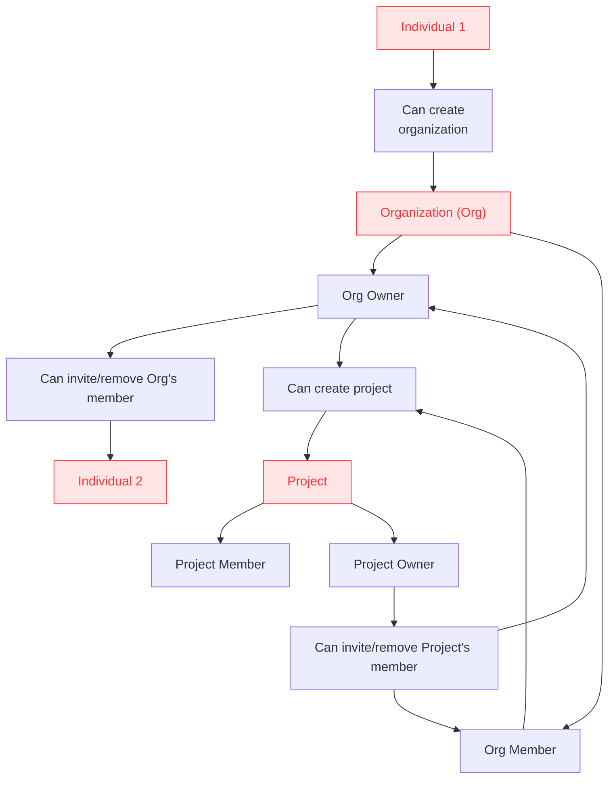
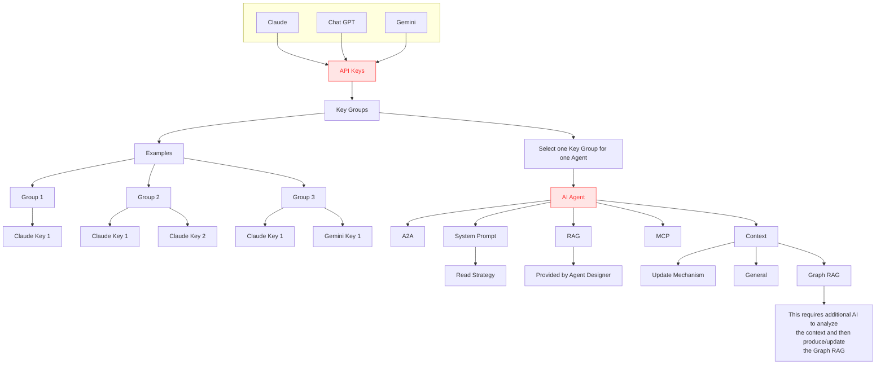
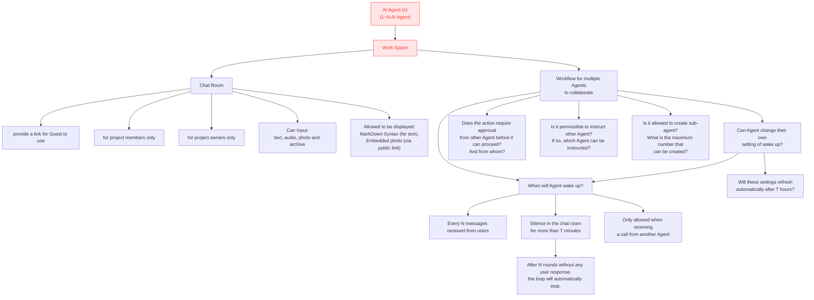

# SMAP — Smart Multi-Agent Platform

> Flowcharts extracted from `SMAP.drawio`. Red-highlighted nodes in the source file are rendered with red fill below (key concepts).

---

## Flowchart 1 — Top-Level Structure

---

## Flowchart 2 — API Keys (Top-Level)

---

## Flowchart 3 — Organization, Individual, Project

---

## Flowchart 4 — AI Agent Composition

---

## Flowchart 5 — AI Agent(s) → Work Space → Chat Room & Workflow

---

## Key Concepts Index

Red-highlighted nodes in the original diagram:

| # | Node | Flowchart |
|---|------|-----------|
| 1 | SMAP — Smart Multi-Agent Platform | 1 |
| 2 | API Keys (platform-level) | 2 |
| 3 | Organization (Org) | 3 |
| 4 | Individual 1 / Individual 2 | 3 |
| 5 | Project | 3 |
| 6 | API Keys (agent-scoped) | 4 |
| 7 | AI Agent | 4 |
| 8 | AI Agent (s) (1~N AI Agent) | 5 |
| 9 | Work Space | 5 |
